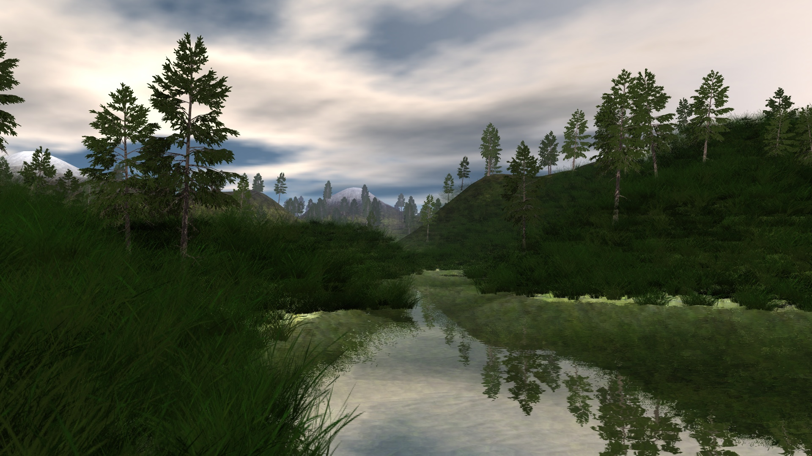
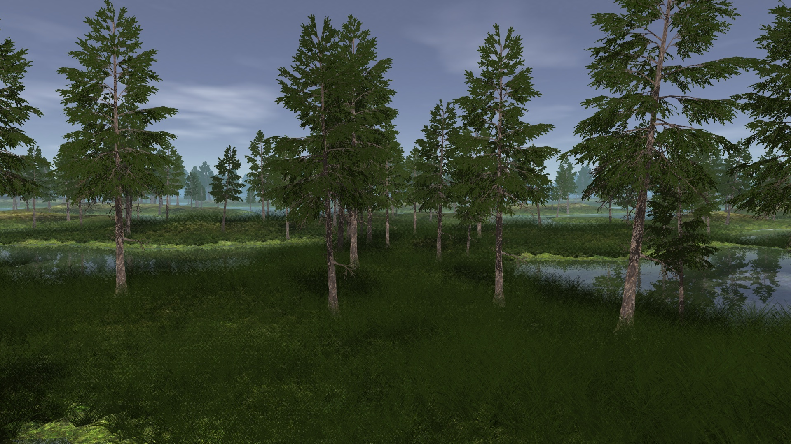
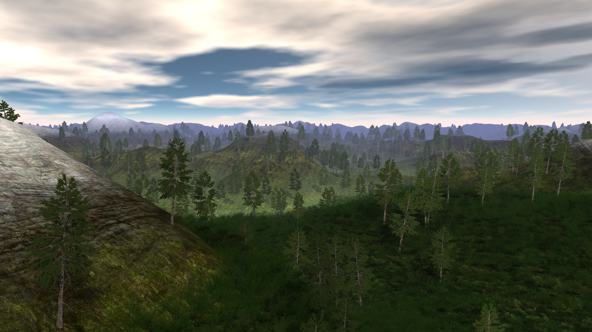
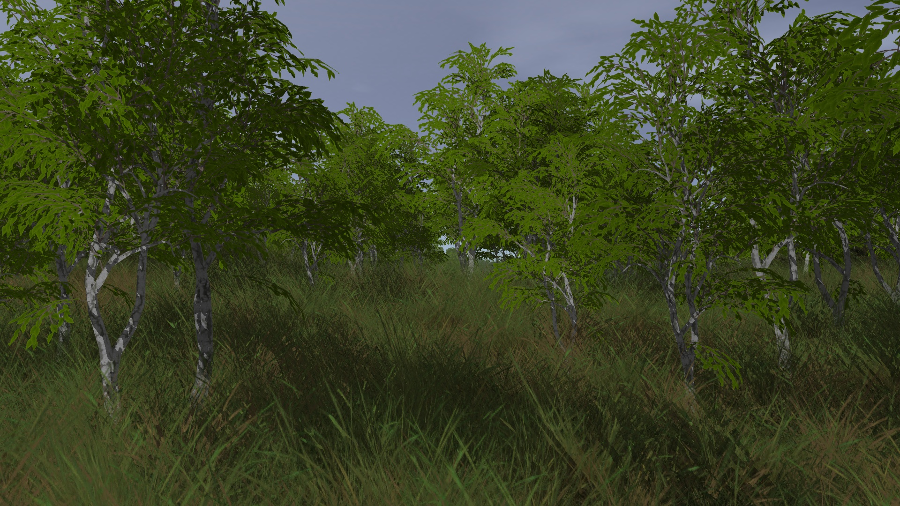
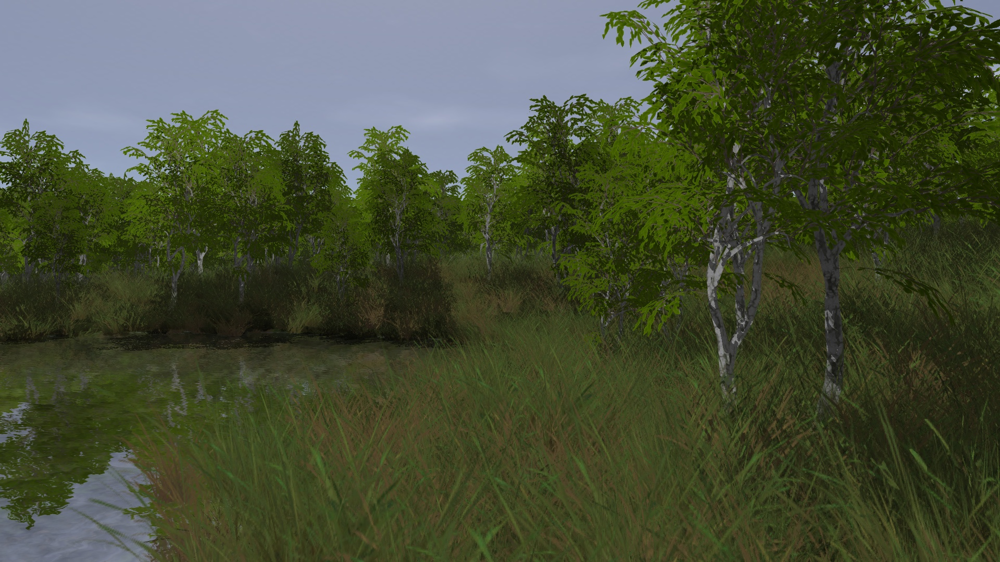
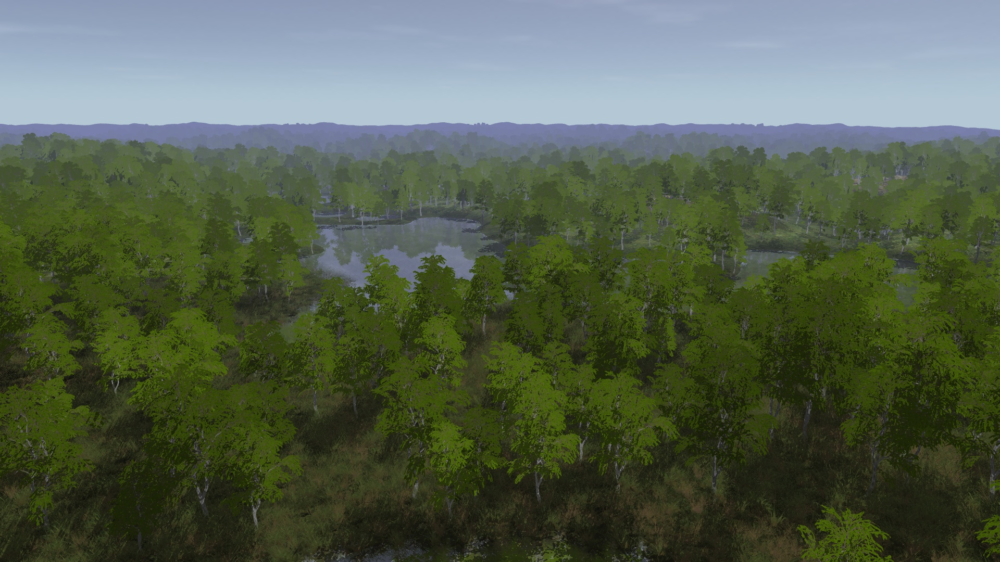
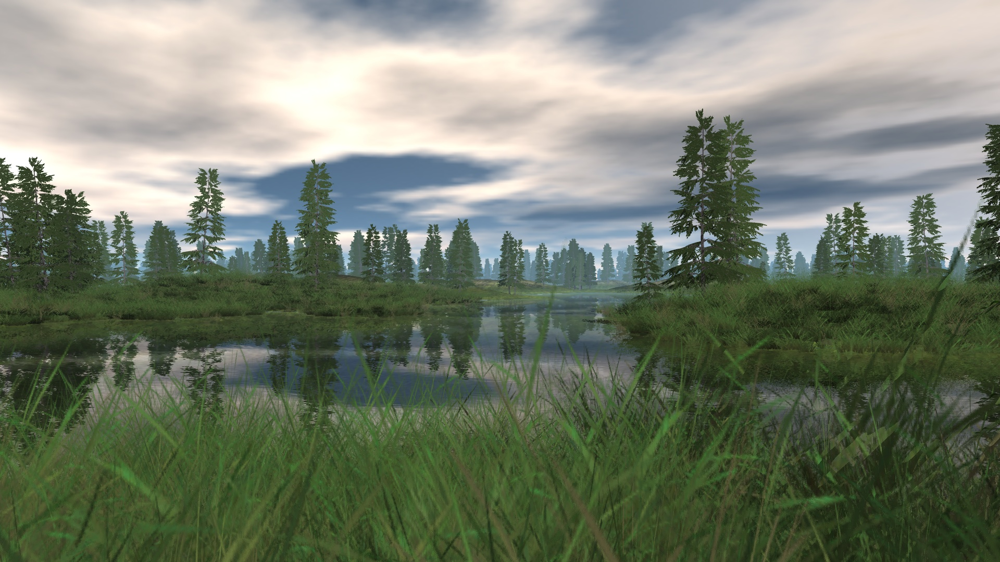
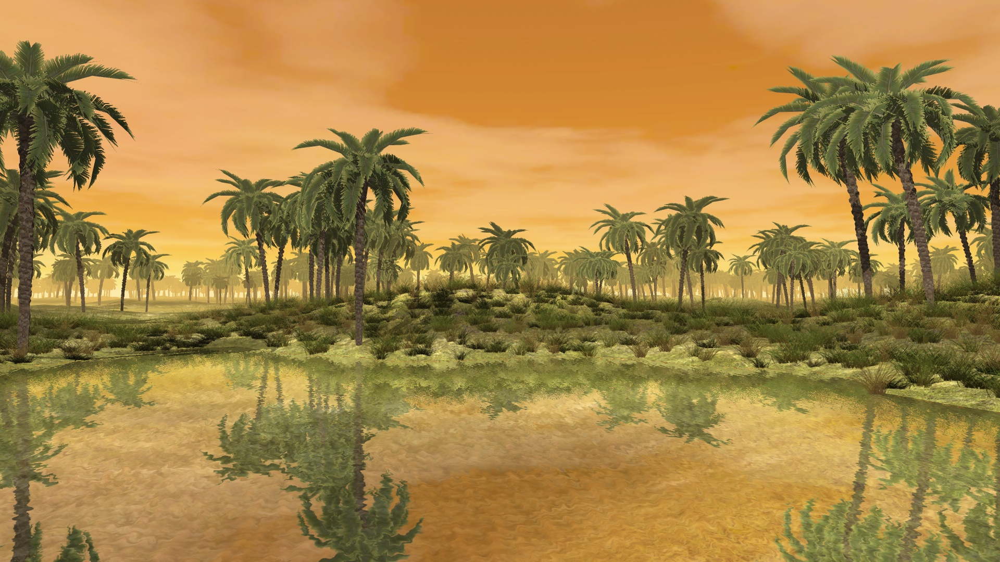

# Vulkan infinite procedurally generated terrain

## About

This is a **personal playground** for an infinite procedurally generated terrain renderer in Vulkan. No guarantee that the code will work.

## Screenshots

## Videos

https://www.youtube.com/watch?v=56WGJljkwuk (Older version)

## Some technical background

* Uses multi-threading for generating newly visible terrain chunkgs
* Draw batches for visible objects (trees, grass) are generated per-frame on the GPU
* "Old school" render-to-texture reflections
* All terrain settings can be changed on the fly
* Renderer
    * Requires Vulkan 1.3
    * Dynamic rendering
    * Single-pass shadow cascade generation using multi view
    * Uses MSAA and alpha-to-coverage for order-independent transparency

